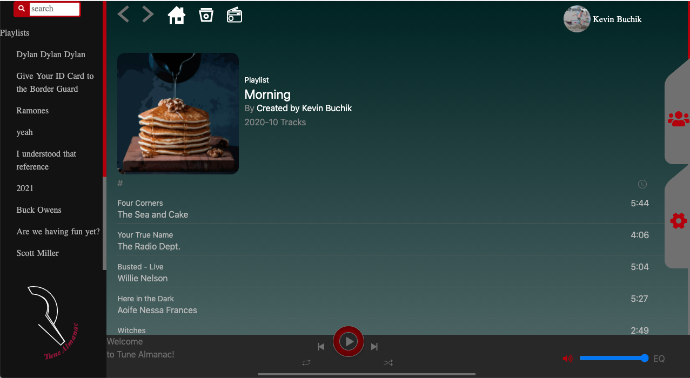
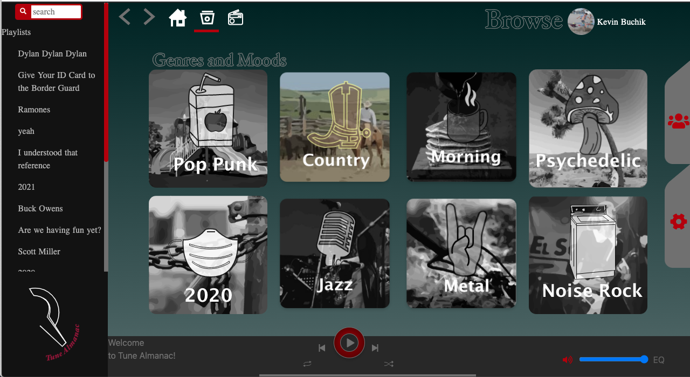

# TuneAlmanac

Tune Almanac is a Spotify clone with an adjustable EQ built with JQuery and the Spotify API with the ability to search for an artist, play a 30 second preview of a song, and connects to your personal Spotify account displaying previously created playlists and saved albums.  

## Technologies
* HTML/CSS
* JavaScript
* JQuery
* JavaScript Audio API
* Spotify Developer API

## Screenshots

## Initial Design 

